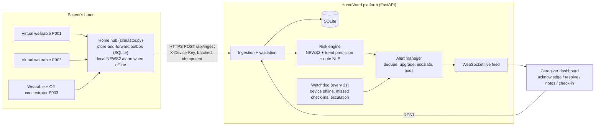

# HomeWard: a hospital ward's awareness in a patient's bedroom

HomeWard is a smart home-care monitoring prototype. It simulates patient sensors, streams the readings to a
web platform, scores risk with explainable clinical logic, predicts deterioration **24–48 hours ahead**,
raises and escalates alerts, and records the caregiver's response.

```
Sense  ->  Understand  ->  Predict  ->  Alert  ->  Respond
IoT sim    NEWS2 + notes    trends      escalation  acknowledge / resolve / check-in
```

No hardware is needed. Everything runs on one laptop with Python.

---

## Quick start (2 minutes)

```bash
pip install -r requirements.txt
python run_demo.py --fresh
```

This starts the platform server and the IoT simulator, then opens http://127.0.0.1:8000.

To run the parts separately (for example, to show what happens when the server goes down):

```bash
python -m homeward.server          # terminal 1: platform (API + dashboard)
python -m homeward.simulator       # terminal 2: virtual wearables + home hub
python -m pytest -q                # tests (24)
```

Requirements: Python 3.10+. All Python dependencies are in `requirements.txt`. The dashboard uses no CDN, so it
works on a local network even without internet access.

---

## What you will see

Three simulated patients, each with a realistic condition:

| Patient | Condition | Default scenario |
|---|---|---|
| P001 Ramesh Kumar, 68 | 5 days after hip surgery, diabetic | **sepsis**: slow infection over ~36 patient-hours |
| P002 Anita Sharma, 75 | Heart failure | stable |
| P003 Joseph D'Souza, 71 | COPD on home oxygen (NEWS2 SpO2 scale 2) | stable |

Simulated time is accelerated: **1 real second = 10 patient-minutes**, so 48 hours play out in about 5 minutes.

Watch P001: while the vitals still look *normal*, the trend engine raises an **early warning**
("HIGH risk predicted in ~40h"). Hours later in patient time the patient really does deteriorate to HIGH. The alert
escalates if nobody responds, and the caregiver acknowledges it with a note.

Use **Demo controls** (top right) to switch scenarios, simulate a network outage, or unplug the oxygen concentrator.

---

## Architecture



More detail: [docs/ARCHITECTURE.md](docs/ARCHITECTURE.md)

| Layer | Tech | File |
|---|---|---|
| IoT simulation | Python, `requests`, SQLite outbox | `homeward/simulator.py` |
| API + live updates | FastAPI, WebSocket, Uvicorn | `homeward/server.py` |
| Storage | SQLite (WAL) | `homeward/db.py` |
| Clinical score | NEWS2 (Royal College of Physicians) | `homeward/news2.py` |
| Prediction | damped linear-trend projection | `homeward/trends.py` |
| Notes NLP | clinical lexicon + negation, EN + basic HI/TE | `homeward/notes.py` |
| Risk fusion + safety rules | rule engine | `homeward/engine.py` |
| Alerts | lifecycle, escalation chain, audit trail | `homeward/alerts.py` |
| Dashboard | vanilla HTML/CSS/JS + canvas charts | `homeward/static/` |

---

## How the AI decides (explainability)

Every decision has a written reason that a caregiver can read and a nurse can check.

1. **NEWS2 score from vitals.** Respiratory rate, SpO2, supplemental O2, systolic BP, heart rate,
   consciousness and temperature each score 0–3 points. A total of 0–4 is LOW, 5–6 (or any single 3) is MEDIUM, and 7+ is HIGH.
   For COPD patients we use NEWS2 SpO2 **scale 2** (target 88–92%), so they don't get false alarms.
2. **Trend prediction (24–48h).** Over the last 6 patient-hours we fit a least-squares line to each vital, keep only
   trends that are statistically meaningful (R² ≥ 0.3 and above a minimum slope), project them forward with damping,
   and re-score NEWS2 for every hour up to 48h. The output reads like "*Heart rate rising ~1.3 bpm/h; projected HIGH in ~38h*".
3. **Caregiver notes.** A clinical lexicon finds symptoms such as confusion, breathlessness, poor intake or a fall. It
   understands negation ("no chest pain", "did not fall") and recognises red flags (chest pain, unresponsive, stroke
   signs). It also handles basic Hindi and Telugu.
4. **Fusion with safety rules** (`engine.py`, all covered by tests):
   - The vitals score is a **floor**. Notes and predictions can only *raise* risk, never lower it.
   - A red-flag note makes the risk **HIGH** immediately.
   - A worrying note raises the risk by at most one level.
   - A credible prediction of HIGH risk (2 or more worsening vitals, confidence at least moderate) turns LOW into a
     MEDIUM **early warning**.
   - De-escalation needs **3 consecutive** improved readings, so the risk doesn't flicker at a threshold.
   - Missing or implausible data (for example SpO2 = 0 when the probe falls off) is rejected and reported, never treated as normal.
   - Every screen states that this is decision support, not a diagnosis, and gives a recommended action.

## Alerts and response

- One active alert per patient per type, so there are no alert storms. If risk worsens, the alert is upgraded and re-opened.
- **Escalation chain** when an alert is not acknowledged: primary caregiver → family and on-call nurse → doctor or
  emergency services (108). The delay is 45s for HIGH and 120s for MEDIUM, configurable in `config.py`.
- The caregiver **acknowledges** with an action note, then **resolves** the alert. Response time is recorded.
- Clinical alerts are **never auto-closed**. Technical alerts (device offline, oxygen supply, battery) clear
  themselves when the problem is fixed.
- Alert types: clinical risk, early warning, wearable/hub offline, oxygen concentrator failure, low battery, and
  missed caregiver check-in.
- Everything is written to an **audit trail** (`events` table, shown on the dashboard).

## Reliability and resilience

| Failure | What happens |
|---|---|
| Internet or server down | The hub writes every reading to a local SQLite **outbox first**, keeps buffering, and replays in order when the connection returns. Nothing is lost. |
| Duplicate delivery on replay | Each reading has a per-device sequence number, and `UNIQUE(device_id, seq)` makes ingestion idempotent. |
| Patient deteriorating while offline | The hub runs NEWS2 **locally** and sounds a local alarm (edge safety net). |
| Device silent | The watchdog raises "wearable/hub offline" after 12s. It auto-resolves on reconnect and reports how many readings were backfilled. Backfilled points appear as ◆ on the charts. |
| Power cut | The hub reports `power: battery` and the dashboard logs it. Run with `--power-cut-after N` to simulate. |
| Hub restarts | The outbox, sequence numbers and simulated clock are persisted, so the hub resumes where it stopped. |
| Dashboard loses its live link | It auto-reconnects the WebSocket and falls back to polling every 3s. |
| Sensor glitch | Implausible values are rejected and flagged, and the chart shows a gap instead of a fake value. |

## Privacy and security

- Patient data stays on the platform you run. No third-party AI or cloud APIs are called.
- Devices must send a shared key (`X-Device-Key`, set it with `HOMEWARD_DEVICE_KEY`). Readings with an unknown patient
  or device are rejected.
- Note text is HTML-escaped in the UI. Inputs are size-limited and validated by Pydantic.
- Production would add caregiver login/roles, TLS, and encryption at rest. These are out of scope for the prototype; see
  [docs/ARCHITECTURE.md](docs/ARCHITECTURE.md#production-roadmap).

## API

| Method | Path | Purpose |
|---|---|---|
| POST | `/api/ingest` | batched sensor readings (needs `X-Device-Key`) |
| GET | `/api/patients` | all patients with latest vitals and risk |
| GET | `/api/patients/{id}` | detail: readings, assessment, notes, alerts, check-ins |
| POST | `/api/patients/{id}/notes` | add a caregiver note (re-scores risk immediately) |
| POST | `/api/patients/{id}/checkin` | caregiver attendance check-in |
| GET | `/api/alerts` | active alerts (`?status=all` for history) |
| POST | `/api/alerts/{id}/ack` / `resolve` | caregiver response `{by, note}` |
| GET | `/api/events` | audit trail |
| GET/POST | `/api/sim/control` | demo scenario control |
| WS | `/ws` | live snapshots |

Interactive API docs are at http://127.0.0.1:8000/docs.

## Configuration

All settings are in `homeward/config.py` and can be overridden with environment variables, for example
`HOMEWARD_ESCALATE_HIGH_SECONDS=30` or `HOMEWARD_SIM_MINUTES_PER_TICK=5`.

## Project structure

```
homeward/
  simulator.py   IoT: virtual patients, scenarios, home hub, outbox, local alarm
  server.py      FastAPI app: ingest, risk, alerts, watchdog, WebSocket, dashboard
  news2.py       NEWS2 scoring
  trends.py      trend fitting + 48h deterioration prediction
  notes.py       caregiver note analysis
  engine.py      risk fusion + clinical safety rules
  alerts.py      alert lifecycle and escalation
  db.py          SQLite schema
  static/        dashboard (index.html, app.js, style.css)
tests/           24 tests: scoring, notes, safety rules, prediction, API flow
docs/            architecture, demo script, Q&A prep
data/            sample caregiver notes
run_demo.py      start everything with one command
```

## Limitations (honest)

- NEWS2 is validated for adults in hospital. Using it at home is a reasonable proxy but has not been clinically validated.
- The prediction is a transparent trend model, not a trained ML model, because we had no real patient outcome data to
  train on. With such data (for example MIMIC-IV), a gradient-boosted model could replace `trends.py` behind the same interface.
- The note analysis is lexicon-based. It is easy to audit but can miss unusual phrasing. An LLM could be added *behind*
  the same safety rules, so it could raise risk but never lower it.
