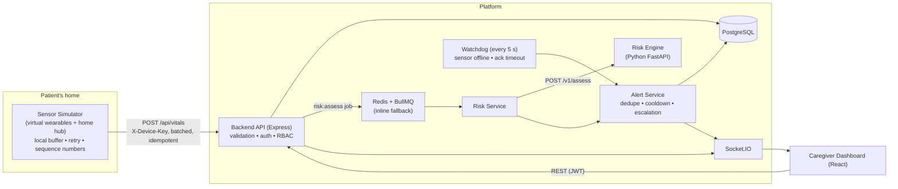
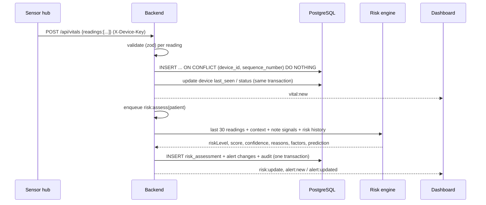
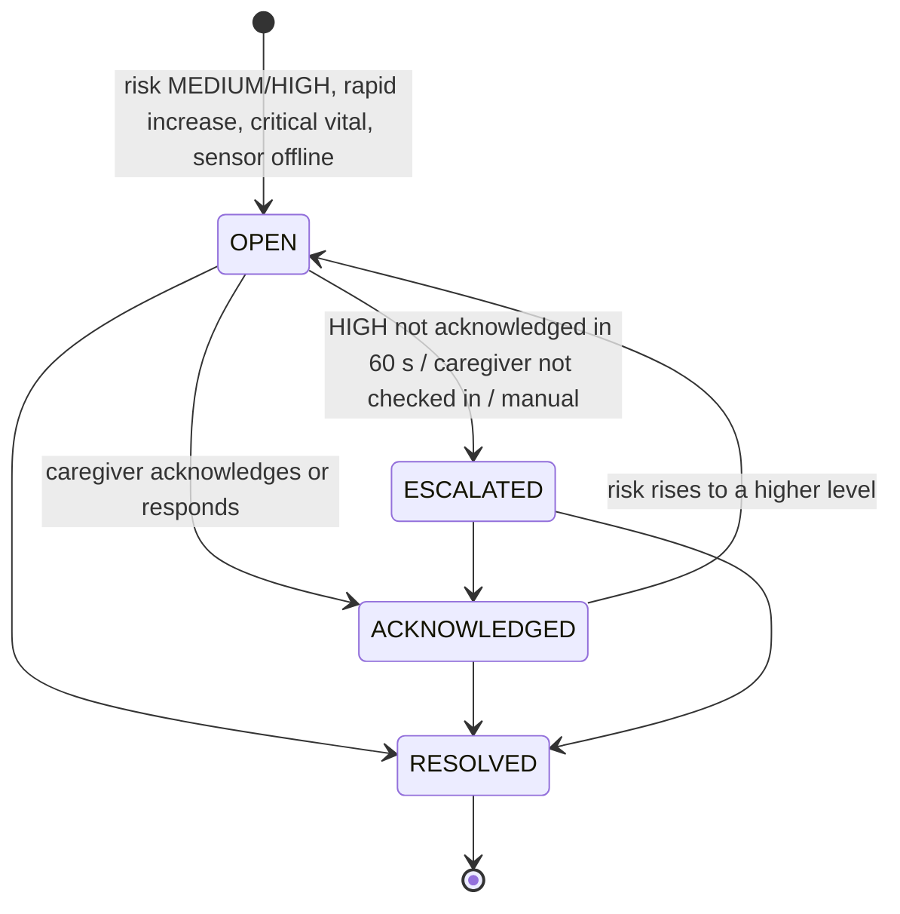
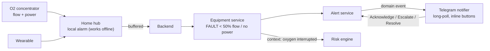

# Architecture

## 1. Overview

| Component | Tech | Responsibility |
|---|---|---|
| Sensor simulator | Node.js | Generates realistic vitals for 3 patients, scenarios, store-and-forward uplink |
| Backend | Node.js, Express, ES modules | Ingestion, auth, RBAC, alerts, attendance, audit, WebSocket |
| Risk engine | Python, FastAPI | Explainable risk scoring + note signal extraction |
| Database | PostgreSQL | System of record (13 tables, enums, FKs, constraints) |
| Queue | Redis + BullMQ | Background risk jobs & watchdog; falls back to inline when absent |
| Dashboard | React, Tailwind, Recharts | Live monitoring and caregiver workflow |

Backend layering: **routes → controllers (thin) → services (business logic) → repositories (SQL) → PostgreSQL**.

## 2. Data flow (one reading)

## 3. Risk calculation (prototype hybrid model)

Implemented in `apps/risk-engine/app/engine/model.py`. Deterministic and explainable: every point can be traced.

| Source | Logic | Points |
|---|---|---|
| A. Current values | Early-warning style bands per vital (RR, SpO2, systolic BP, HR, temperature), median of last 3 readings | 0–3 per vital × 5 |
| B. Trends | Last 20 readings: mean of first 3 vs last 3; SpO2 ↓≥2, HR ↑≥8, RR ↑≥3, Temp ↑≥0.4, SBP ↓≥10 | +6 each (+10 if ≥2× threshold) |
| C. Combined | 2 worsening signals / 3+ worsening signals | +8 / +15 |
| D. Context | Age ≥65 / ≥80; respiratory or cardiac history *when related vitals are involved* | up to +12 |
| E. Notes | Structured signals from caregiver notes (last 2 h): breathing difficulty 10, chest discomfort 12, confusion 10, dizziness 5, fatigue 4, reduced appetite 3, pain 3 | up to +24 |
| F. Recovery | ≥2 improving trends and none worsening | −10 |

**Safety floors** (cannot be lowered by anything): any critical value (SpO2 ≤ 88, RR ≥ 30 or ≤ 8, HR ≥ 131 or ≤ 40, SBP ≤ 90, Temp ≥ 39.5) → ≥ 70 (HIGH); early-warning points ≥ 7 → ≥ 65; any single vital scoring 3 → ≥ 40; a red-flag note (chest discomfort, confusion) → ≥ 35.

Levels: **0–34 LOW · 35–64 MEDIUM · 65–100 HIGH**. Confidence (0.2–0.95) grows with the amount of data and trend consistency (R²) and drops with missing vitals.

**Prediction (24–48 h).** Risk velocity = current score − score ~60 s earlier (needs ≥ 20 s of history). Trend: ≥ +5 increasing, ≤ −5 decreasing. Projected risk = current + velocity. The statement (e.g. *"Elevated deterioration risk over the next 24–48 hours if the current trend persists."*) is always labelled as a prototype trend projection, not a clinical prediction.

**Replaceable model.** `RiskModel` is an interface and `get_model()` picks the implementation via `RISK_MODEL`. A trained ML model can be registered under a new name without touching the API contract, the backend, or the safety rules around it.

**Notes / NLP.** `notes.py` extracts a fixed vocabulary of signals with negation handling ("no chest pain" is ruled out). Any extractor, including a future LLM, must pass `validate_signals()`, which drops anything outside the allowed vocabulary. The backend validates again. Free text never sets the risk.

## 4. Alert lifecycle

- **Deduplication**: at most one active alert per patient per category (`CLINICAL`, `DEVICE`), enforced by a partial unique index. Higher risk upgrades the existing alert instead of creating a new one.
- **Cooldown**: after resolution, the same or a lower level is not re-raised for `ALERT_COOLDOWN_SECONDS`.
- **Escalation**: the watchdog escalates HIGH alerts not acknowledged within `ACK_TIMEOUT_SECONDS`. HIGH alerts escalate immediately when the assigned caregiver is not checked in.
- Clinical alerts are only closed by a person. Device alerts auto-resolve when data returns.
- Every action is stored in `alert_actions` and `audit_logs`, in the same transaction as the change.

## 5. Failure handling

| Failure | Behaviour |
|---|---|
| Backend / network down | Simulator keeps measuring; readings go to a durable local buffer (`data/buffer.json`, atomic writes) and are tagged `BUFFERED` |
| Retry | Exponential backoff with jitter: 1 s, 2 s, 4 s … max 30 s; immediate retry when the connection is restored |
| Reconnection | Buffer uploaded in order, in batches of 100; backend records a `BUFFER_SYNC` sensor event + audit entry; dashboard shows "N buffered readings synchronised" |
| Duplicate delivery | `UNIQUE (device_id, sequence_number)` + `ON CONFLICT DO NOTHING` → counted as duplicate, never stored twice. Sequence numbers persist across simulator restarts |
| Sensor stops reporting | Watchdog marks the device OFFLINE after `SENSOR_OFFLINE_SECONDS` and raises "Sensor connectivity issue detected". **No risk assessment runs on missing data**, so silence is never treated as deterioration |
| Invalid reading | Rejected with field-level errors; in a batch only that reading is rejected |
| Risk engine down | Backend uses a deterministic safety-threshold fallback (critical values still → HIGH), clearly labelled `backend-safety-fallback` |
| Redis down / absent | Jobs run inline in the backend process, in order per patient |
| Database down | 503 `DATABASE_UNAVAILABLE`; the simulator keeps buffering and retries |
| WebSocket disconnect | Socket.IO reconnects automatically; the header shows "Reconnecting…"; pages reload data on events |
| Malformed note / JSON | 400 with a clear message |

## 5b. Equipment, edge alarm and phone alerts

- **Equipment**: readings go to `/api/equipment` (idempotent). A status change to FAULT raises an `EQUIPMENT` alert (HIGH, one active per patient), re-assesses risk with `equipment: [{type, status: FAULT}]` (+12 points and a MEDIUM floor), and auto-resolves on recovery. `ON_BATTERY` is audited without alerting.
- **Edge alarm**: `HubAlarms` in the simulator evaluates every reading with the same critical thresholds as the backend (`criticalFindings` in `packages/shared`). Alarms are raised locally whether or not the cloud is reachable and clear after 5 normal readings. Raise, silence and clear events are queued in the same durable buffer and stored idempotently (`sensor_events.event_uid`).
- **Telegram**: the alert service emits `alert.changed` domain events after commit. The notifier serialises them per alert: new / upgraded / escalated alerts send a new message (the phone buzzes), while acknowledged / response / resolved edit that message in place. Button taps arrive via `getUpdates` long polling, are accepted only from configured chats, and run the same `alertService` methods as the dashboard (same transactions, same audit). Every send is recorded in `notifications`.

## 6. Observability

Structured JSON logs (pino) with `request_id`, `patient_id`, `event_type`, `timestamp`, `processing_time_ms`. Key event types: `VITAL_RECEIVED`, `RISK_CALCULATED`, `ALERT_CREATED`, `ALERT_ACKNOWLEDGED`, `ALERT_ESCALATED`, `SENSOR_OFFLINE`, `SENSOR_ONLINE`, `BUFFERED_READING_SYNCED`, `RISK_ENGINE_UNAVAILABLE`, `REDIS_UNAVAILABLE`. The request id is forwarded to the risk engine (`X-Request-Id`).

## 7. Security

JWT authentication, bcrypt password hashing, roles ADMIN and CAREGIVER (demo reset is ADMIN-only), a separate device key for ingestion, zod validation on every input, parameterised SQL only, helmet + CORS allow-list, secrets in environment variables (`.env` is git-ignored). The risk engine receives only age and conditions, never names or contact details.
